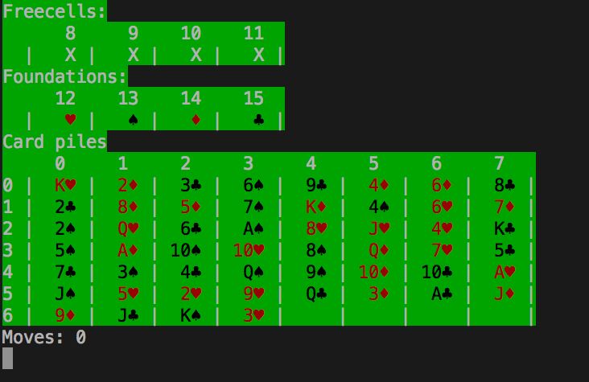

# FreeCell
Text based version of the Microsoft classic
- Supports multiple card moves according to free cells available
- Setup:
  - Download folder
  - run `$ ruby freecell.rb`
  - Move cards using `[[card_col, card_row], destination_col]` (see labels)
  - Play until you win!

